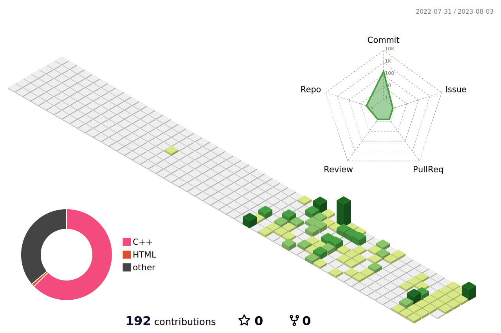

### Hi there 👋

<!--
**apg0001/apg0001** is a ✨ _special_ ✨ repository because its `README.md` (this file) appears on your GitHub profile.

Here are some ideas to get you started:

- 🔭 I’m currently working on ...
- 🌱 I’m currently learning ...
- 👯 I’m looking to collaborate on ...
- 🤔 I’m looking for help with ...
- 💬 Ask me about ...
- 📫 How to reach me: ...
- 😄 Pronouns: ...
- ⚡ Fun fact: ...
-->

<!-- 기찬 이름 로고 -->

  

<!-- 링크 -->

<!-- 프로그래밍 언어 -->

    💡Language  
    
    
    
    
    

<!-- 웬 프로그래밍 언어 -->

    💡Web Language  
    
    
    

<!-- 툴? 기술? -->

    💡Tools  
    

<!-- 협업 툴 -->

    💡Cowork Tools  
    

<!-- 백준 티어 -->
   

<!-- 깃헙 정보 -->

    

<!-- 3D 잔디 -->
    
