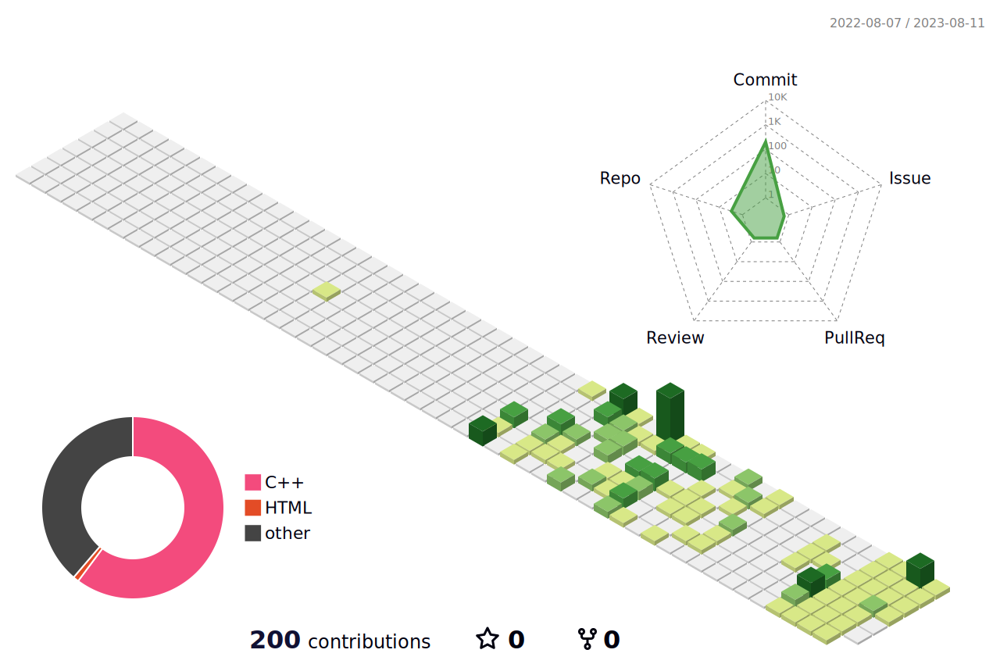

<!-- ### Hi there 👋 -->

  

저는 **박기찬**입니다! 🌱  
기술로 세상에 가치를 선물하는 개발자입니다.

---

<!-- 기존 프로그래밍 언어, 웹 언어, 프레임워크 섹션 그대로 유지 -->

<!--
**apg0001/apg0001** is a ✨ _special_ ✨ repository because its `README.md` (this file) appears on your GitHub profile.

Here are some ideas to get you started:

- 🔭 I’m currently working on ...
- 🌱 I’m currently learning ...
- 👯 I’m looking to collaborate on ...
- 🤔 I’m looking for help with ...
- 💬 Ask me about ...
- 📫 How to reach me: ...
- 😄 Pronouns: ...
- ⚡ Fun fact: ...
-->

<!-- 기찬 이름 로고 -->

  

<!-- 링크 -->

<!-- 프로그래밍 언어 -->

    💡Programming Language  
    
    
    
    
     
    
    
    

<!-- 웬 프로그래밍 언어 -->

    💡Web Language  
    
    
    
     
    
    

<!-- 프레임워크 -->

    💡Framework  
    
    
    

<!--
개발환경

    💡IDE  
    
    
    
    
     
    
    
    
    

-->

<!-- 협업 툴 -->

    💡Cowork Tools  
    
    

---

## 🏅 경력 & 활동

| 기간 | 내용 |
|-----------|-----------------------------|
| 2021.1 ~ 2021.12 | 동국대학교 43대 공과대학 학생회 **엔돌핀** 기획국원 |
| 2022.1 ~ 2022.12 | 동국대학교 30대 정보통신공학과 학생회 **Comma** 홍보국원 |
| 2022.1 ~ 2022.12 | 동국대학교 31대 정보통신공학과 학생회 **Buddy** 홍보국원 |

---

## 👥 동아리 활동

| 기간 | 내용 |
|-----------|-----------------------------|
| 2021.1 ~ 2021.7 | 동국대학교 공과대학 소모임 **CAPS 34기** 집행부 학술부원 |

---

## 🏆 수상 경력

- **2024년 한이음 공모전**  
  "LLM을 활용한 우울증 방지 챗봇" **입선**

- **2025년 헐트프라이즈 온캠퍼스 경진대회 안영대학교**  
  "적대적 공격을 활용한 딥페이크 방지" **최우수상**

---

<!-- 백준 티어 -->
   

<!-- 깃헙 정보 -->

    

<!-- 3D 잔디 -->
    
